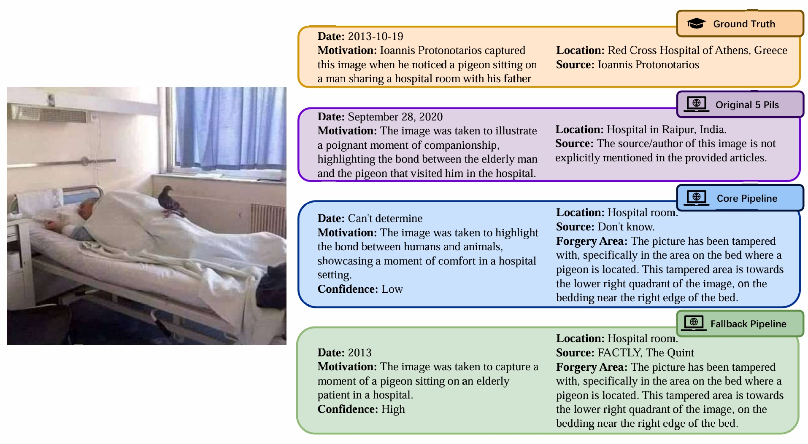
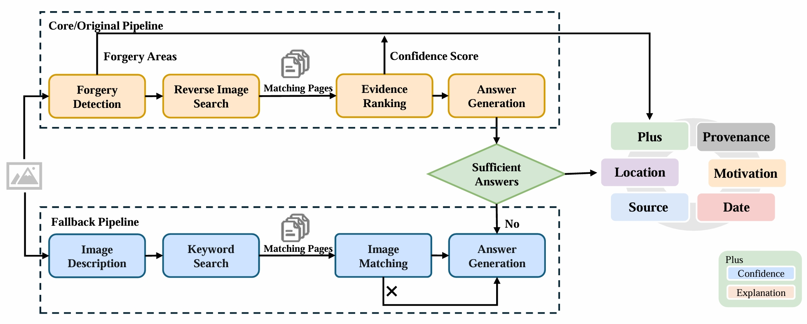

# DualMind: A Novel Framework for Automated Image Contextualization and Meta-context Retrieval

[](https://opensource.org/licenses/Apache-2.0)
[](https://www.python.org/)

This repository is an extension of the **5Pillars framework** introduced by [Tonglet et al. (2024)](https://aclanthology.org/2024.emnlp-main.448). Our goal is to produce more **explainable** and **reliable** 5Pillars (5Pils) answers by incorporating essential contextual elements—such as **Source**, **Date**, **Location**, and **Motivation**—and enriching them with additional relevant information. Moreover, the framework introduces a **confidence score** to indicate the trustworthiness of each generated answer, supported by an explanation of any detected manipulations for improved transparency and interpretability.

Contact person: Zhenghua Bao ([zheng.hua.b@gmail.com](mailto:zheng.hua.b@gmail.com))

## Abstract

The rapid proliferation of visual misinformation highlights the critical need for effective automated tools to assist human fact-checkers. Recent advances, such as the “5 Pillars” framework, have introduced structured approaches for contextualizing images by identifying Provenance, Source, Date, Location, and Motivation. However, current automated methods face notable limitations: manipulation detection approaches largely neglect semantic discrepancies, evidence retrieval often misses critical supporting materials, and generated explanations frequently rely on irrelevant or biased information. To address these gaps, we propose a novel pipeline—**DualMind**, extending the original 5 Pillars framework with significant improvements: 

- A semantically-informed forgery detection method integrating SAM-based semantic segmentation, CLIP-ViT image features, and LLM-based reasoning; 

- Expanded evidence retrieval leveraging multiple reverse image search engines with evidence re-ranking using media bias and semantic relevance scores; 

- Contextual-aware answer generation; 

- A fallback pipeline employing keyword-based textual search when image-based retrieval fails. 

Experiments demonstrate that DualMind significantly improves evidence retrieval coverage, reduces misinformation in generated answers, and enhances the overall reliability of image contextualization. By systematically evaluating contextual reliability and forgery explanations, DualMind offers fact-checkers more robust and reliable references for detecting and debunking visual misinformation.

### Demo output

<p align="center">
  
</p>


## Create environment

```
$ conda create --name DualMind python=3.9
$ conda activate DualMind
$ pip install -r requirements.txt
$ python -m spacy download en_core_web_lg
```

## 5Pils dataset

We used 5pillars dataset provided by [Jonathan Tonglet](mailto:jonathan.tonglet@tu-darmstadt.de).

You can collect the images using the following script:

```
$ python scripts/build_dataset_from_url.py
```

## Pipeline

<p align="center">
  
</p>

You can generate answers for a specific pillar. The plus pillar includes a **confidence score** and **forgery explanation**. For example, to generate answers for the **Date** pillar using multimodal zero-shot LLaVA:

```
$ python scripts/get_5pillars_answers.py --results_file output/results_date.json --task date --modality multimodal --n_shots 0 --model llava
```

## Citation

If you use this work or the underlying dataset, please cite the original 5Pillars paper:

```bibtex 
@inproceedings{tonglet-etal-2024-image,
    title = "{``}Image, Tell me your story!{''} Predicting the original meta-context of visual misinformation",
    author = "Tonglet, Jonathan  and
      Moens, Marie-Francine  and
      Gurevych, Iryna",
    editor = "Al-Onaizan, Yaser  and
      Bansal, Mohit  and
      Chen, Yun-Nung",
    booktitle = "Proceedings of the 2024 Conference on Empirical Methods in Natural Language Processing",
    month = nov,
    year = "2024",
    address = "Miami, Florida, USA",
    publisher = "Association for Computational Linguistics",
    url = "https://aclanthology.org/2024.emnlp-main.448",
    pages = "7845--7864",
}
```


## Disclaimer

> This project was developed as part of the **Project Lab: Multimodal Artificial Intelligence 2024** at **TU Darmstadt**. It builds heavily upon the foundational work ["Image, Tell me your story!" Predicting the original meta-context of visual misinformation](https://aclanthology.org/2024.emnlp-main.448/).
>
> We sincerely thank the original authors for sharing their dataset and answering our questions. Special thanks to our mentor **Mark** for his insightful guidance and support throughout the course.
